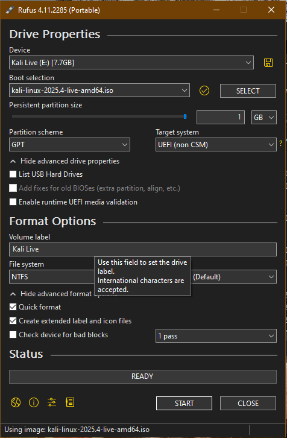
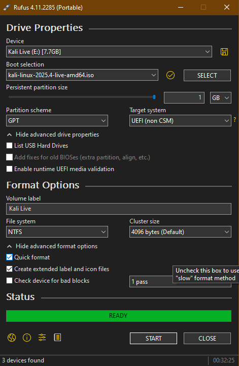
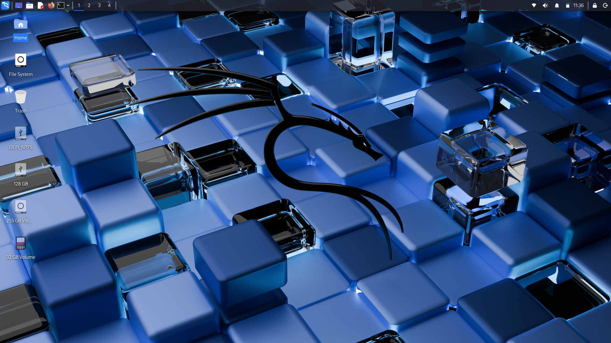
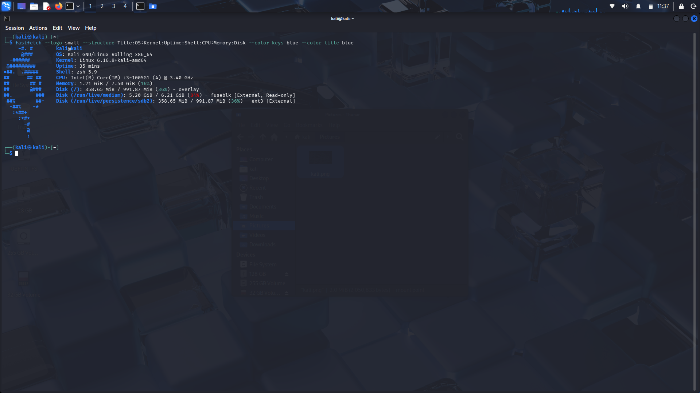
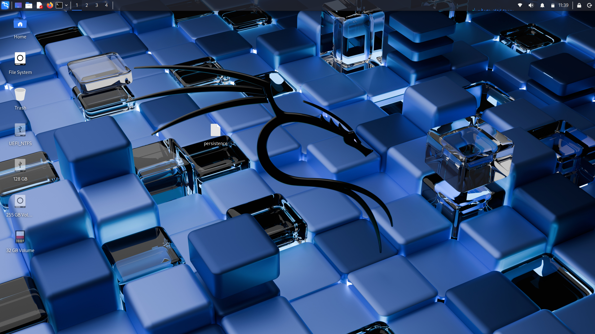

# Portable Kali Linux Cybersecurity Lab Setup

Created a persistent bootable Kali Linux USB using Rufus for portable penetration testing and security labs.

## Tools Used
- Rufus
- Kali Linux ISO
- 8GB USB
- Persistence storage

## Steps Performed
1. Created bootable USB using Rufus
2. Configured persistence partition
3. Installed security tools
4. Tested Nmap, Wireshark, Metasploit
5. Verified data persistence after reboot

## Purpose
Allows portable cybersecurity testing and lab practice on any PC.

## Skills Demonstrated
- OS installation
- Disk partitioning
- Linux configuration
- Troubleshooting boot issues

## Proof of Setup

### Rufus Configuration

### Kali Booted

### Persistence Setup

### Nmap Scanned

### Wireshark Capture

### Metasploit Console
